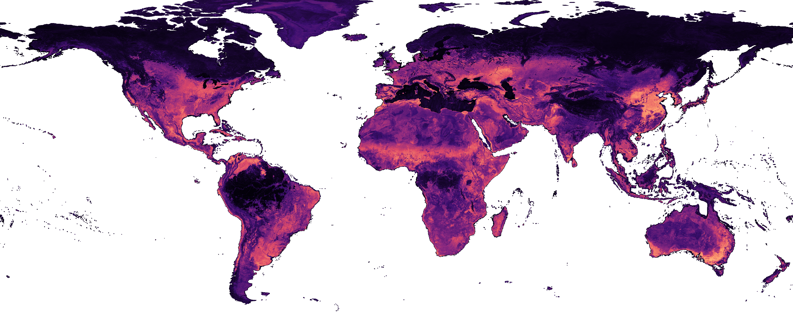

# Global Solar-Siting Suitability from Satellite Embeddings

Predicting **where new solar installations are viable, anywhere on Earth**, directly from satellite
imagery — using Google DeepMind's **AlphaEarth (AEF) 64-dimensional per-pixel embeddings** and a
compact, globally-deployable random forest.



*Global solar-suitability at 100 m (magma; brighter = more suitable land). Produced by the model in
this repository from 2025 AlphaEarth embeddings.*

---

## What this is

Existing solar-siting tools rank land with hand-weighted GIS layers (slope, irradiance, land cover,
distance to grid). This project instead **learns what makes a site developable** from the embedding
of the land *as it looked ~2 years before real installations were built* — capturing the pre-existing
surroundings rather than the panels themselves. The output is a per-pixel suitability score in
`[0, 1]`, rendered as global 10 m and 100 m rasters.

- **Signal:** AlphaEarth annual embeddings (64-D, 10 m), sampled two years before install date.
- **Labels:** a global inventory of existing PV-facility footprints (positives) versus presumed-
  unsuitable land drawn ≥ 5 km from any known solar site (negatives).
- **Model:** a random forest constrained to a compact tree representation so it can run **server-side
  inside Google Earth Engine** for planetary-scale inference (≤ ~9 MB of exported tree strings).

## Why it works — and how it was checked

Because the honest question is *"does it rank land where solar actually gets built next?"*, the model
is judged on **forward validation against real future installations**, not on in-sample pixels:

- **Country-scale forward ROC** — score a country on AlphaEarth *before* a cohort of installs, then
  test against those later installs (deduplicated from training). Strong discrimination across 13
  countries.
- **Spatial holdout (leave-one-country-out)** and **temporal holdout** (train on past imagery only,
  forecast future installs) — both confirm the signal generalises rather than memorising.
- **External validation** against an independent, automatically-detected solar dataset (TZ-SAM).
- **Beats standard GIS multi-criteria (MCDA)** with literature-sourced expert weights, in every
  install-country tested (paired bootstrap).
- **Orthogonal to irradiance / energy-yield products** — it captures *developability*, a signal the
  physical-resource layers miss, so it complements rather than duplicates them.

A "deep-lookback" test (scoring installs 2–7 years into the future from fixed older imagery) shows the
suitability comes from stable land context, not from detecting construction already under way.

## The dataset

A global **solar-suitability raster** (10 m and 100 m, EPSG-native, magma-scaled) generated from 2025
AlphaEarth embeddings. The 100 m preview above is included here; the full rasters are large data
products released separately.

## Repository layout

Code is grouped by function; the full per-script index is in **[`SCRIPTS.md`](SCRIPTS.md)**.

| folder | contents |
|---|---|
| *(root)* | shared library modules (`run_country_rf`, `train_rf_v3`, `results_util_v3`, `gee_tree_fix`, …) + docs |
| `pipeline/` | training-pool construction from AlphaEarth chips |
| `train/` | model training + the GEE-budget capacity/architecture sweeps |
| `validate/` | the forward-validation ladder (country, LOCO, temporal, external) |
| `gee/` | Earth Engine deployment + global raster export |
| `figures/` · `analysis/` | paper figures and covariate / capacity / benchmark analyses |
| `negatives/` | negative-set construction & decontamination |
| `jobs/` | SLURM + shell runners |

Two utilities worth knowing about:
- **`gee_tree_fix.py`** — corrects `geemap`'s serialization of best-first (`max_leaf_nodes`) random
  forests so they parse correctly inside Earth Engine. Apply it before exporting any such model.
- **`run_country_rf.py`** — end-to-end country/region scoring with the GEE-injected forest.

## Environment & usage

The conda environment is defined in [`environment.yml`](environment.yml) (`solar-siting-ml`,
Python 3.11; `scikit-learn`, `geopandas`/`rasterio`, `earthengine-api` + `geemap`).

```bash
conda env create -f environment.yml
conda activate solar-siting-ml

# train the deployable RF on a pixel pool and score held-out pixels
python train_rf_v3.py --pool <pool>.npz --test <test>.npz --out model.joblib --scheme R

# score a country region through Earth Engine (suitability map + validation)
python run_country_rf.py --iso3 ESP --year 2021
```

Earth Engine access requires `ee.Authenticate()` / `ee.Initialize(project=...)`. Heavy training runs
are driven from `jobs/`. See `SCRIPTS.md` for the full pipeline and each script's purpose.

## Data sources

- **AlphaEarth embeddings** — Google `GOOGLE/SATELLITE_EMBEDDING/V1/ANNUAL` (via Earth Engine).
- **Solar PV inventory** (positives) — a global facility-footprint database.
- **Independent validation** — the TZ-SAM automatically-detected solar dataset.

## Status

Active research code. A manuscript describing the method and the released dataset is in preparation.
If you use this work, please open an issue for the appropriate citation.
